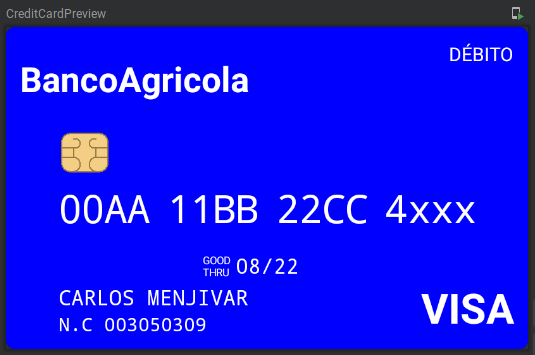

# Credit card preview
A simple composable component that displays credit/debit card information.

## Preview


## Usage
```kotlin
@Composable
@Preview
fun CreditCardPreview() {
    val creditCard = CreditCardModel(
        number = "00AA11BB22CC4",
        personName = "carlos menjivar",
        expiration = "08/22"
    )

    CreditCard(
        model = model,
        emptyChar = 'X',
        backgroundColor = Color.Black
    )
}
```