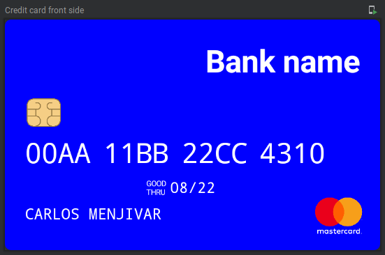
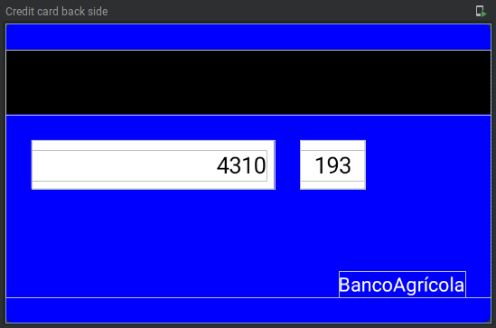

# Credit card preview
A simple composable component that displays credit/debit card information.

## Usage
```kotlin
@Preview(name = "Credit card front side")
@Preview
fun CreditCardFrontPreview() {
    val creditCard = CreditCardModel(
        number = "00AA11BB22CC4310",
        holderName = "carlos menjivar",
        expiration = "08/22"
    )
    CreditCard(
        model = creditCard
    )
}
```



```kotlin
@Preview(name = "Credit card back side")
@Composable
fun CreditCardBackPreview() {
    val creditCard = CreditCardModel(
        number = "00AA11BB22CC4310",
        cvc = "193",
        bankName = "BancoAgrícola"
    )
    CreditCard(
        model = creditCard,
        flipped = true
    )
}
```


## Next steps
- [ ] Create an standar design for the card
- [ ] Include back view
- [ ] Add inputs to fill the view
- [ ] Include testing
- [ ] Upload project to centralMaven